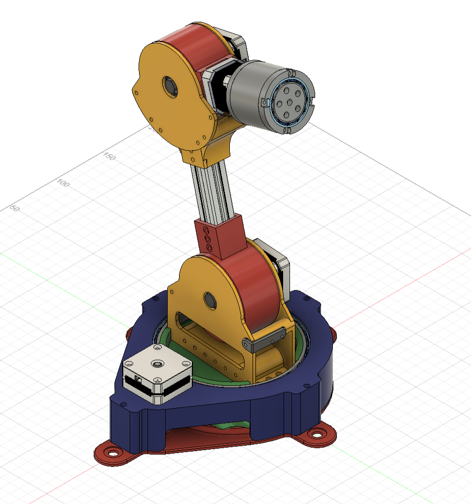
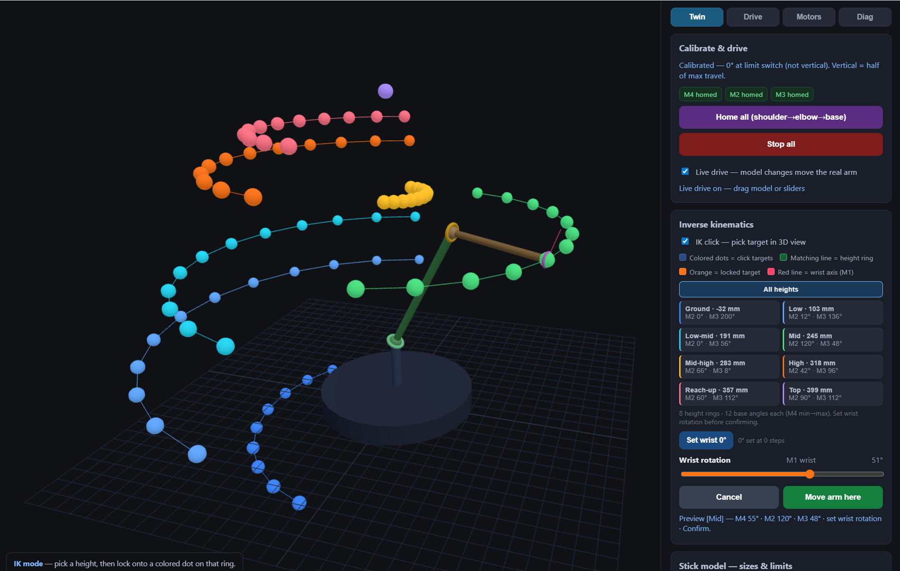

# OREO — 4-DOF Robotic Arm

OREO is a 4 DOF robotic arm controlled with an esp32. The joints use 3D printed cycloidal gear reductions and stepper motors.

**Setup & docs:** [docs/GETTING_STARTED.md](docs/GETTING_STARTED.md)
